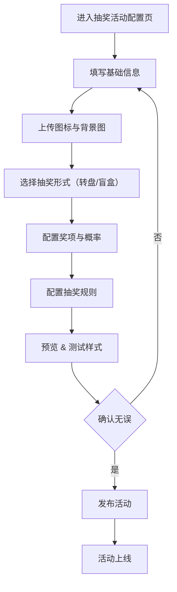

## 抽奖活动模块 PRD

> **当前范围**：仅实现“抽奖活动”模块，支持两种前端表现形式：大转盘 / 开盲盒，内部奖项配置与逻辑保持一致。

---

### 一、功能列表

#### 1. 活动基础配置

- 活动名称
- 赞助方
- 活动图标（上传）
- 活动背景（上传）
- 活动描述（多行文本）
- 活动开启时间：
  - 具体时间选择器
  - 或立即开启（勾选）

#### 2. 抽奖形式

- 抽奖 UI 类型选择：
  - 大转盘（默认）
  - 开盲盒（卡片翻转动画）
- **注意**：仅影响前端展示，不影响奖项逻辑与概率计算。

#### 3. 奖项配置

- 奖项等级：特等奖、一等、二等等（下拉选择）
- 奖品名称（文本）
- 奖品图片（上传）
- 奖项概率（百分比）
- 最多支持配置 10 项
- 支持添加/删除奖项项（动态表单）

#### 4. 抽奖规则设置（扩展）

- 抽奖限制：每人一次/每人每日限定次数（数值）
- 附加说明或参与条件（选填）

#### 5. 发布 & 管理

- 草稿保存
- 预览模式（抽奖形式模拟）
- 发布按钮
- 活动状态：未开始 / 进行中 / 已结束

---

### 二、功能流程图（更新）



---

### 三、数据结构接口定义（API Schema）

#### 1. 活动配置接口

```json
{
  "id": "string", // 活动ID，编辑时使用
  "name": "幸运大转盘活动",
  "sponsor": "XXXX",
  "iconUrl": "https://...",
  "backgroundUrl": "https://...",
  "description": "欢迎参与抽奖，赢取大奖！",
  "startTime": "2025-06-01T12:00:00Z",
  "startImmediately": false,
  "uiType": "turntable" // "turntable" | "blindbox"
}
```

#### 2. 奖项配置接口

```json
{
  "prizes": [
    {
      "level": "特等奖",
      "name": "iPhone 15",
      "imageUrl": "https://...",
      "probability": 1.5
    },
    {
      "level": "一等奖",
      "name": "AirPods",
      "imageUrl": "https://...",
      "probability": 3.0
    }
    // 最多 10 个奖项
  ]
}
```

#### 3. 抽奖规则配置接口

```json
{
  "dailyLimit": 1,
  "shareBonusEnabled": true,
  "extraConditionNote": "登录后可参与，每天可抽一次"
}
```

#### 4. 活动发布操作

```http
POST /api/lottery/submit
Content-Type: application/json

{
  // 合并上述配置字段（activity + prizes + rules）
}
```

---
